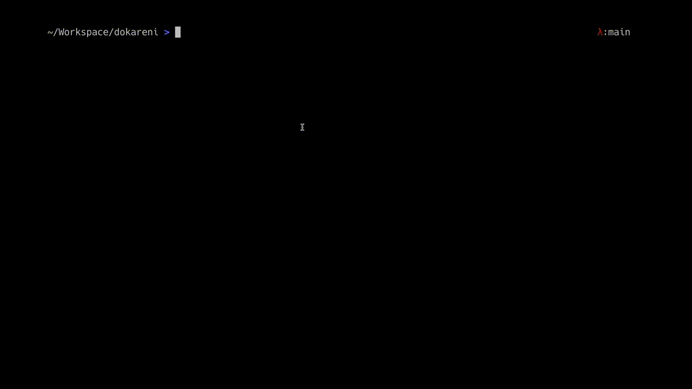

# :musical_score: dokareni

Dokareni is a system to express and comprehend music, to communicate musical ideas and patterns, specifically in pitch changes. 

## code in this project

### About the python programs
* `dokareni_test.py` and `dokareni_test2.py` are great for practicing intervals in dokareni system. `dokareni_base.py` contains the main notes to compose a randomised practice with the intervals.
* `dkrn_chrats_5ths.py` and `dkrn_chrats_wheel.py` produce diagrams with colors for the dokareni notes.

### :movie_camera: Program gifs



### how to run
```
# running a script
source venv/bin/activate
python3 -m pip install -r requirements.txt
python3 dokareni_test.py 
deactivate

# creating virtual env, installing dependencies
virtualenv venv 
source venv/bin/activate
python3 -m pip install <pip-package>
pip freeze > requirements.txt 
```

## reasoning behind developing the notation system

In modern times, musical instruments use a 12-note system (there is kind of a natural explanation on why 12 are enough). However, people express music in terms of english letters or music sheets, making it kind of inaccessible to understand. Common problems with the current system is that:
* not all notes have specific names (e.g Cb or B# is the same note, with different names)
* the 7 note narrative makes it harder for people to interpret alternative music scales (like middle eastern scales may skip some notes)
* it's really difficult to understand the distances between different pitches (so many complex systems and exceptions to the rules, e.g. C D have distance of semitone distance, whereas D E have distance of 2 semitones). the difference of semitontes between notes is essential to the feeling that a specific melody creates.
* simplyfing the note system and enhancing it to be more easily interpretable by the brain (such as adding colors), would make music more intuitive and hence more easy to develop complex/interesting sounding ideas.

Also, from mathematical perspective, music notes create a modular arithmetic system.

## basics

In order to make music more easily interpretable, each pitch/note in music (essentially key in the piano), takes it's own name. 

Furthermore, all notes follow some basic rules:
* they follow the 2-letter of (`consonant` + `vowel`)
* the letters are easy to phonetically reproduce by many people. 
* the `consonant` is different for each note.
* the `vowel` is the same for every 4 notes (4 vowels that create 4 groups of 3 equally distanced notes) (we can use the equally distanced rule to enhance comprehension and counting distances between notes) 
* the should be really close to the famous (do, re, mi, fa, sol, la, ti) pattern.

Hence, the new system has the following pattern:
```
note name - number - name in classical music - color in RGB
do (d)  -   0   -   C       - #80ff00 (chartreuse)
ka (k)  -   1   -   C#/Db   - #00ff00 (green)
re (r)  -   2   -   D       - #00ff80 (springgreen)
ni (n)  -   3   -   D#/Eb   - #00ffff (cyan)
mo (m)  -   4   -   E       - #0080ff (azure)
fa (f)  -   5   -   F       - #0000ff (blue)
ze (z)  -   6   -   F#/Gb   - #8000ff (violet)
si (s)  -   7   -   G       - #ff00ff (magenta)
po (p)  -   8   -   G#/Ab   - #ff0080 (rose)
la (l)  -   9   -   A       - #ff0000 (red)
ve (v)  -   10  -   A#/Bb   - #ff8000 (orange)
ti (t)  -   11  -   B       - #ffff00 (yellow)
```

Dokareni is about building a system with symmetries (colours, etc) so that patterns can be easily described (while also being easy to learn). 

There are many exercises that can be done to get familiarity with the naming, until somebody gets really familiar. Singing upwards and downwards with 1,5,7 semintones. (cycle of 4ths,5ths). or grouping the notes by distance of (2,3,4,6 semitones). Examples below: 

```
# cycle of 1 semitone:

dkrnmfzsplvtd 
dtvlpszfmnrkd

# cycle of 3 (or 9) semitones (4 notes per cycle) (3 quadruplets)

dnzl nzld zldn ldzn, 
    lznd zndl ndlz dlzn
kmsv msvk svkm vkms, 
    vsmk smkv mkvs kvsm 
rfpt fptr ptrf trfp,
    tpfr pfrt frtp rtpf

0 3 6 9. (0 mod 3)
d n z l

1 4 7 10. (1 mod 3)
k m s v 

2 5 8 11. (2 mod 3)
r f p t

# cycle of 4 (or 8) semitones (3 notes per cycle) (4 triplets)

dmp mpd pdm, pmd mdp dpm
kfl flk lkf, lfk fkl klf 
rzv zvr vrz, vzr zrv rvz
nst stn tns, tsn snt nts

# cycle of 6ths (6 pairs):

dz ks rp nl mv ft
zd sk pr ln vm tf

# cycle of 5/7 semis
dsrlmtzkpnvfd
dfvnpkztmlrsd

# packs of 7root5
sdf  pkz  lrs  vnp  
tml  dfv  kzt  rsd  
npk  mlr  fvn  ztm  
```

## next step

There is the concept of movable do and fixed do. Similarly in dokareni, we can consider two systems:
* fixed do, where do refers to note C in the piano. 
* movable do, where do refers to the tonic (key) of the song.

In order to enhance comprehension, I usually use fixed do to refer to notes (thus every key on the piano gets a fixed name). However, I color the notes differently (with tonic for each song getting the same color).
The colors are equally spaced in the RGB coloring, and I have the hexadecimal encoding in the table above.

## learning about chords / modes in dokareni

```
TODO
# major(0,4,7).   minor(0,3,7).  augmented(0,4,8).   diminished(0,3,6).

dms.       dns.       dmp.       dnz.
dms.       dns.       dmp.       dnz.
dms.       dns.       dmp.       dnz.
dms.       dns.       dmp.       dnz.
dms.       dns.       dmp.       dnz.
dms.       dns.       dmp.       dnz.
dms.       dns.       dmp.       dnz.
dms.       dns.       dmp.       dnz.
dms.       dns.       dmp.       dnz.
dms.       dns.       dmp.       dnz.
dms.       dns.       dmp.       dnz.

```


```
# ionian/major (C-mode) (do-mode)
0   2   4   5   7   9   11  0    # semitones
  T   T   S   T   T   T   S      # semitone diffs

R   2   3   4   5   6   7   R    # jazz writing
C   D   E   F   G   A   B   C    # starting from C 
C   D   E   F   G   A   B   C    # playing only naturals (white keys)

do  re  mo  fa  si  la  ti  do   # starting from do
do  re  mo  fa  si  la  ti  do   # playing only naturals (white keys)


# dorian (D-mode) (re-mode)
0   2   3   5   7   9   10  0    # semitones
  T   S   T   T   T   S   T      # semitone diffs

R   2   3b  4   5   6   7b  R    # jazz writing
C   D   Eb  F   G   A   Bb  C    # starting from C 
D   E   F   G   A   B   C   D    # playing only naturals (white keys)

do  re  ni  fa  si  la  ve  do   # starting from do
re  mo  fa  si  la  ti  do  re   # playing only naturals (white keys)


# phrygian (E-mode) (mo-mode)
0   1   3   5   7   8   10  0    # semitones
  S   T   T   T   S   T   T      # semitone diffs

R   2b  3b  4   5   6b  7b  R    # jazz writing
C   Db  Eb  F   G   Ab  Bb  C    # starting from C 
E   F   G   A   B   C   D   E    # playing only naturals (white keys)

do  ka  ni  fa  si  po  ve  do   # starting from do
mo  fa  si  la  ti  do  re  re   # playing only naturals (white keys)


# lydian (F-mode) (fa-mode)
0   2   4   6   7   9   11  0    # semitones
  T   T   T   S   T   T   S      # semitone diffs

R   2   3   4#  5   6   7   R    # jazz writing
C   D   E   F#  G   A   B   C    # starting from C 
F   G   A   B   C   D   E   F    # playing only naturals (white keys)

do  re  mo  ze  si  la  ti  do   # starting from do
fa  si  la  ti  do  re  mo  fa   # playing only naturals (white keys)


# mixolydian (G-mode) (si-mode) (dominant 7th chord)
0   2   4   5   7   9   10  0    # semitones
  T   T   S   T   T   S   T      # semitone diffs

R   2   3   4   5   6   7b  R    # jazz writing
C   D   E   F   G   A   Bb  C    # starting from C 
G   A   B   C   D   E   F   G    # playing only naturals (white keys)

do  re  mo  fa  si  la  ve  do   # starting from do
si  la  ti  do  re  mo  fa  si   # playing only naturals (white keys)


# aeolian/minor (A-mode) (la-mode)
0   2   3   5   7   8   10  0    # semitones
  T   S   T   T   S   T   T      # semitone diffs

R   2   3b  4   5   6b  7b  R    # jazz writing
C   D   Eb  F   G   Ab  Bb  C    # starting from C 
A   B   C   D   E   F   G   A    # playing only naturals (white keys)

do  re  ni  fa  si  po  ve  do   # starting from do
la  ti  do  re  mo  fa  si  la   # playing only naturals (white keys)


# locrian (B-mode) (ti-mode)
0   1   3   5   6   8   10  0    # semitones
  S   T   T   S   T   T   T      # semitone diffs

R   2b  3b  4   5b  6b  7b  R    # jazz writing
C   Db  Eb  F   Gb  Ab  Bb  C    # starting from C 
B   C   D   E   F   G   A   B    # playing only naturals (white keys)

do  ka  ni  fa  ze  po  ve  do   # starting from do
ti  do  re  mo  fa  si  la  ti   # playing only naturals (white keys)

```